# 第一問

## (1)

ワードロップの第一原則：利用される経路の所要時間が皆等しくなり、利用されなかった経路の所要時間よりも小さいかせいぜい等しくなる。このとき、どの利用者も経路を変更することによって所要時間を短縮できないため、均衡が安定する。

## (2)

$$
20+0.001x+30+0.004x=30+0.004(10000-x)+15+0.001(10000-x)
$$

を解いて、 $x=4500$

## (3)

OA-AB-BDの経路の交通量がある程度増える。ただしABのリンクコスト関数次第では、Braessのパラドックスによって全体のパフォーマンスが低下する恐れもある。

## (4)

ルート1の所要時間は 90, ルート2の所要時間は 55 となる。

所要時間差35分、対応する課金額は1400円。

## (5)

xxooox

②同一発着同一料金化し、NEXCOの環状道路を利用した場合にこれまでより安くなるよう料金が設定された。

⑥ロンドンはトールリングではなく、エリア内を走れば直ちに課金される、エリアプライシング制。

# 第二問

## (1)

地上測量：レベルを用いて標高既知の点から進展までの標高差を測ることを繰り返す。

航空機レーザー測量：航空機からレーザー光を発射し、返ってくるまでの時間を測ることで地表までの距離を測定する。

航空機写真測量：航空機から複数の写真を撮り、写真上の像の違いから地表の立体的な構造を復元する。

衛星リモートセンシング干渉SAR：衛星搭載の合成開口レーダ(SAR)によって、複数回同じ場所を観測することによって、観測場所の地表面の形やその変化を調べる。

## (2)

### (a)

### (b)

可視画像の撮影は、地上から反射してくる様々な波長の光の強弱を捉えるので、人間が目で見るのと同様の像が得られる。

レーダーの撮影は、航空機から発射したレーザーが物体に反射して返ってくるまでの時間を計測するので、航空機からの距離が遠い点ほど画像の中心から遠くに写る。

### (c)

可視画像の幾何学的ゆがみを補正するには、大きく分けてシステム補正と基準点をもとにした幾何補正が用いられる。

システム補正ではセンサーの幾何学的特性などの情報をもとに系統的に補正する。

基準点をもとにした幾何補正では、座標が既知の基準点が画像内でどこに写っているか調べ、それをもとに変換式のパラメータを決定する。

[Ⅱ　衛星データ利用マニュアル (nilim.go.jp)](http://www.nilim.go.jp/lab/bcg/siryou/eiseireport/no2/1-6.pdf)

### (d)

草地など地表の構造が比較的単純なところではHH成分が、森林など地表の構造が複雑な所ではHV成分が卓越する。このようにして、ある程度土地被覆を分類できるような画像が得られる。
